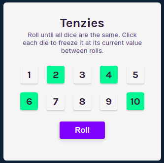
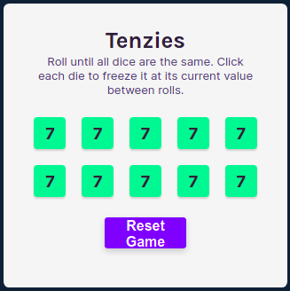

# Practice from Freecodecamp video 

[React Course Video](https://www.youtube.com/watch?v=bMknfKXIFA8).

## Tenzies Game - states and events

This project was bootstrapped with [Create React App](https://github.com/facebook/create-react-app).

## Available Scripts

In the project directory, you can run:

### `npm start`

Runs the app in the development mode.\
Open [http://localhost:3000](http://localhost:3000) to view it in your browser.

#### Personal note. 

This is my version before watch the possible solution.\
DONE -> The default status could be random numbers.\
Counter of rolls and a message of "You do it in ## rolls!!!"\
Can use [nanoid](https://github.com/ai/nanoid) to generate unique id's, but at this moment is ok